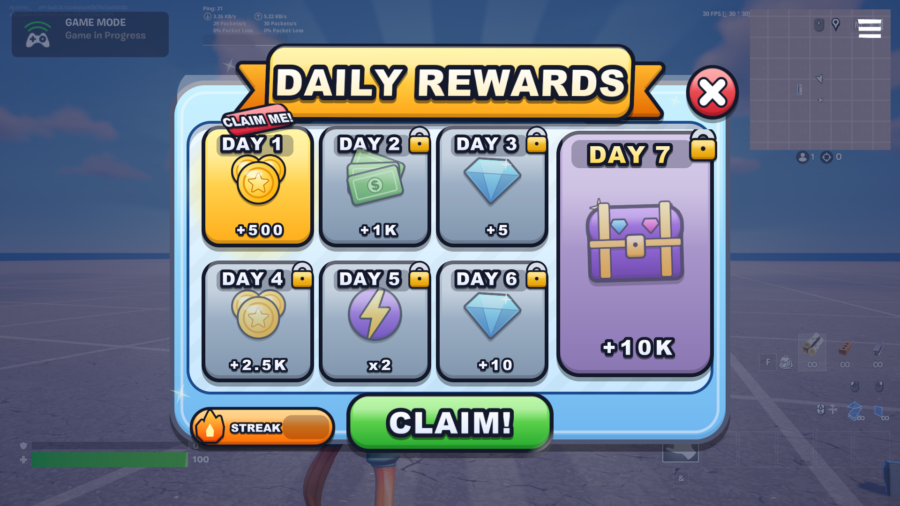
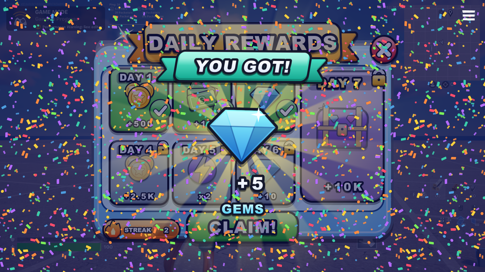

# Example: Roblox-style Daily Reward UI (built entirely through MCP)

7-day streak calendar (day 7 = MEGA chest), persistent per player, juicy animations, tycoon reward hooks.
Status: built and played in a UEFN 42.30 session; clicks/Escape/close confirmed by a human tester.

## Pieces
| Layer | Assets |
|---|---|
| Verse (`verse/`) | `dr_anim.verse` easing + cancellable tween channels · `dr_data.verse` rewards, `persistable` save, number→glyph formatting · `dr_view.verse` per-player UI composition, click layers, all choreography · `daily_reward_device.verse` device: config, streak logic, granting, open/close, Escape, HUD reminder |
| Widgets (built by `scripts/sandbox/mcp_build_cards.py` + lib) | `WBP_DR_Frame`, `WBP_DR_Card`, `WBP_DR_MegaCard`, `WBP_DR_ClaimButton`, `WBP_DR_CloseButton`, `WBP_DR_Popup`, `WBP_DR_Glyph`, `WBP_DR_Notify` |
| Materials (`mcp_build_materials.py`) | `M_DR_Rays/Glow/Bob/Shine/Sparkle/Confetti/Stripes` + instances |
| Art (`scripts/art/gen_art.py`) | 62 PNGs: panel, ribbon, card frames, icons, buttons, pills, digit glyphs, FX textures |

## Device settings
`Rewards` (Kind, Amount, Granters, GrantRepeat, Triggers per day) · `SecondsPerDay` (86400) · `StreakResetAfterDays` (2) ·
`OpenButtons`/`OpenTriggers` (link by hand) · `AutoOpenOnJoin` (off) · `ShowReadyReminder` · `AutoCloseAfter` (90) ·
sounds · test-only: `ResetProgressOnJoin`, `DebugAutoClaimAfter`.
Your code can `RewardClaimedEvent.Await()` → `dr_claim_info{Player, DayIndex, Kind, Amount}`.

## Mistakes made on the way (all fixed — see MCP_RULES.md)
1. Fields invisible to Verse until the widget editor was opened.
2. Text widgets not placeable → baked text + glyph sprites.
3. `SetRenderTransformAngle` not allowed → `MakeTransform`.
4. All-blank glyph row in a ScaleBox → popup number never appeared → prime with a value.
5. UMG button events never reached Verse; UMG widgets in a canvas swallowed clicks → transparent Verse hit-area buttons on top.
6. Menu auto-opened on join (unwanted) and had no way out → button-only open, X/Escape/click-outside/timeout close.
7. Auto-close `race` cancelled itself → UI gone but mouse still captured → race only the wait + `defer` RemoveWidget.
8. Gloss layer poked out above the panel outline; sticker text not rotated with its pill → art generator fixes.
9. After a full 7-day cycle the other cards stayed "claimed" → refresh all card states on unlock.
